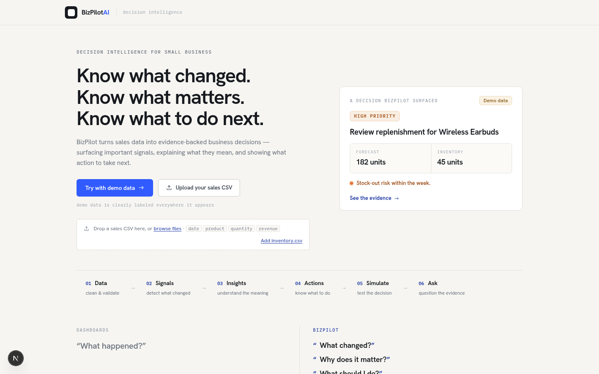
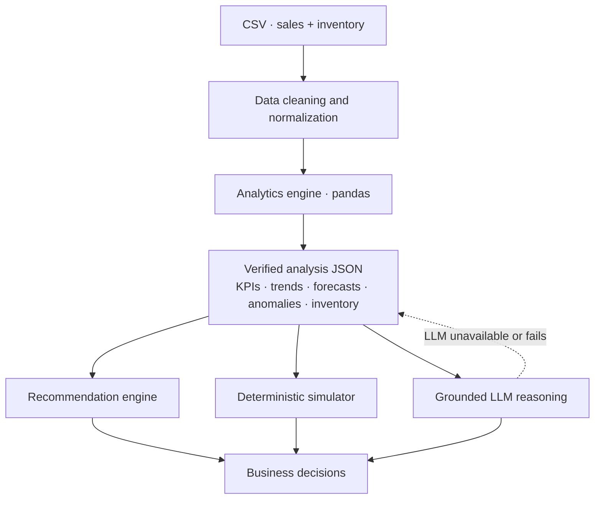
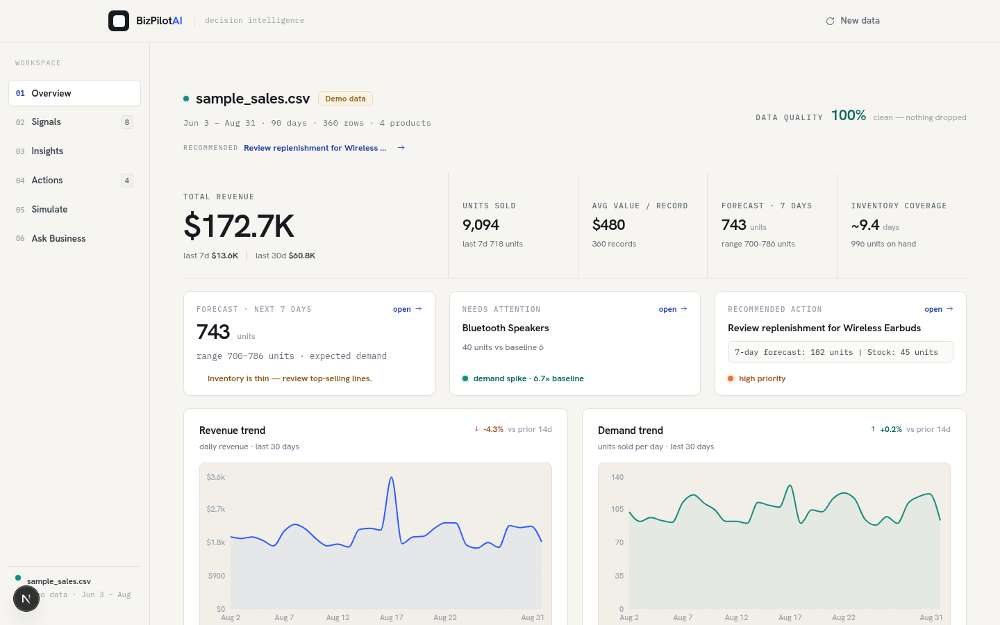
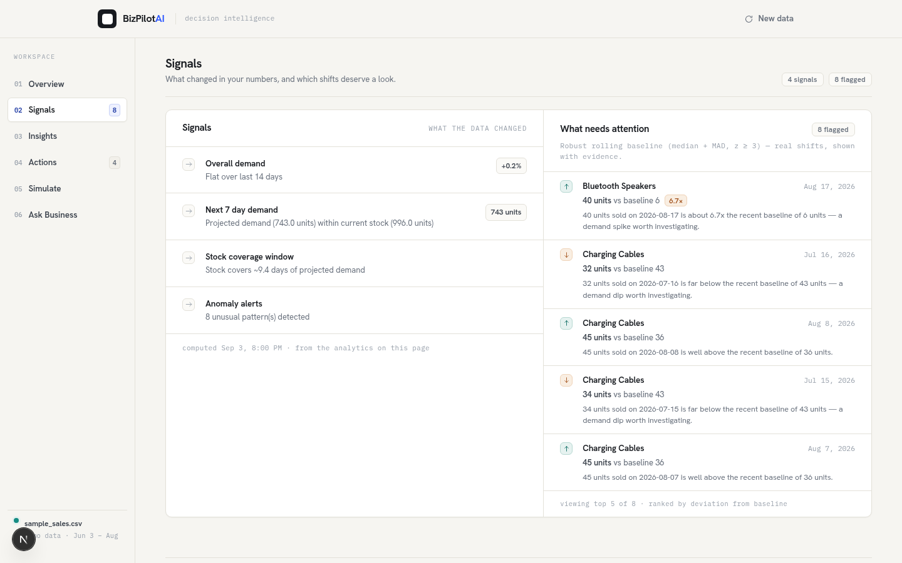
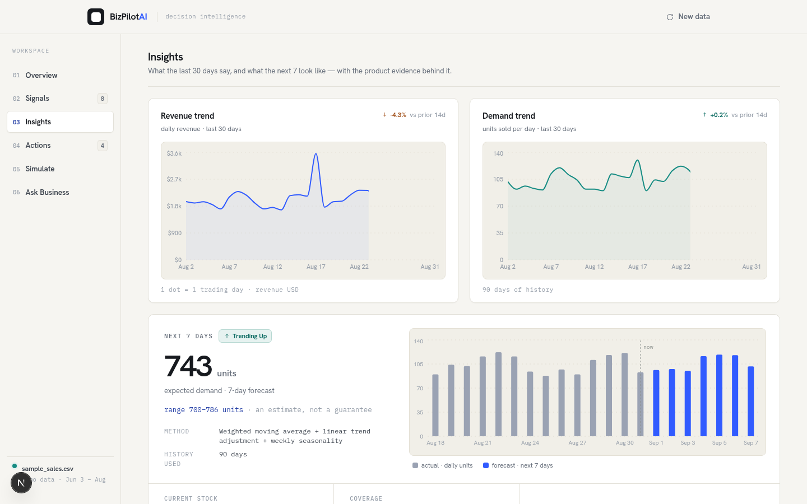
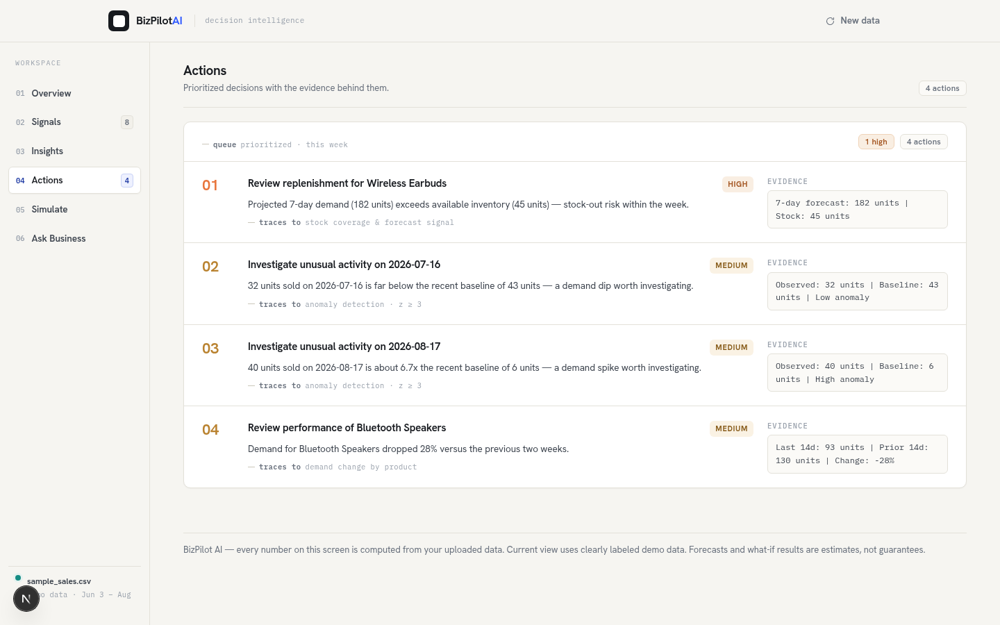
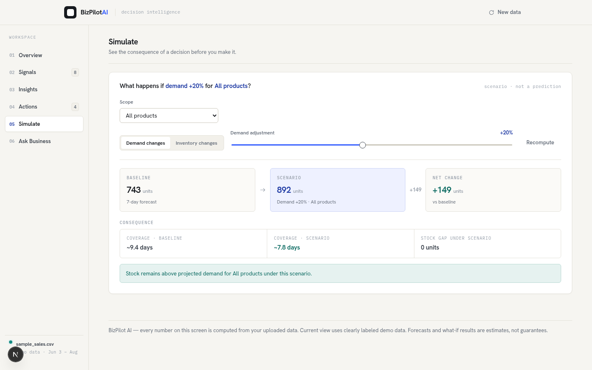
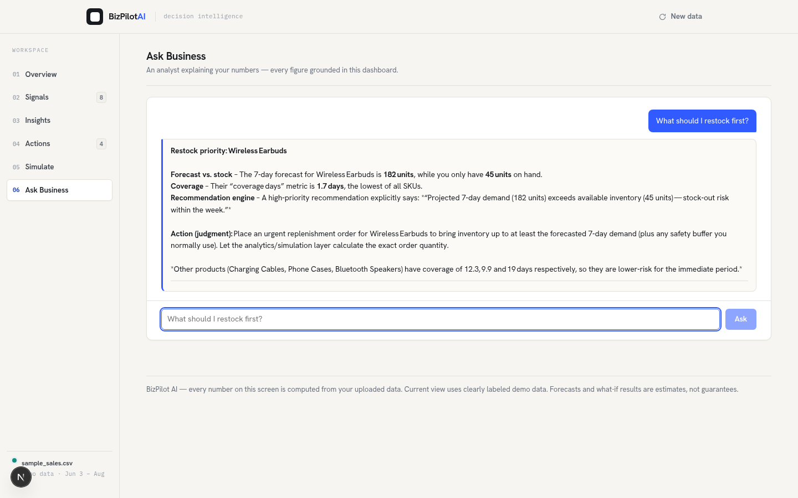

# BizPilot AI

*Decision intelligence for small business.*

> Turn everyday sales and inventory data into predictions, signals, recommendations, and grounded business decisions.

**Hackathon project · Next.js · TypeScript · Python · pandas · recharts · Gemini / OpenAI-compatible LLM · Vercel**

**[Live demo](https://bizpilot-two.vercel.app)** · [GitHub repository](https://github.com/BinarySpecter/BizPilot)



---

## The problem

Small businesses have the data — sales, inventory, the spreadsheet that's lived there for years. What they don't have is the time or the expertise to keep interpreting it.

Traditional dashboards answer *"What happened?"*

BizPilot answers the questions a business actually asks:

- **What changed?**
- **Why does it matter?**
- **What should I do next?**
- **What happens if I act?**

---

## The solution

BizPilot is a decision flow, not a collection of charts:

```
Data  →  Signals  →  Insights  →  Actions  →  Simulate  →  Ask
```

- **Signals** — something moved in your numbers.
- **Insights** — what that movement means.
- **Actions** — what to do about it, with the evidence attached.
- **Simulate** — test the action before committing.
- **Ask** — interrogate the evidence in plain language.

What-if scenarios are always deterministic. The LLM explains; it never does the math.

---

## The architecture



Numbers are computed first. The Python/pandas analytics layer is the numerical source of truth; the LLM receives the verified analytics context and explains it. The build sits in one repo — a Next.js frontend plus Python serverless functions (`/api/*`) — and deploys to Vercel as a unit.

---

## Product

The application is a desktop-style workspace with persistent navigation: one data load, six connected views, each a click away — not a page of scrolling.

| | |
|---|---|
|  |  |
| **Overview** · current state, KPIs, forecast, coverage, the top signal and the top action | **Signals** · what changed, plus anomalies with computed evidence |
|  |  |
| **Insights** · trends, 7-day forecast, per-product evidence | **Actions** · a prioritized queue; each item carries its numbers and priority |
|  |  |
| **Simulate** · deterministic demand/inventory scenarios → coverage, gap, risk | **Ask Business** · natural-language questions grounded in computed analytics |

All screenshots show the built-in demo dataset, labelled **Demo data** in the product.

---

## Technical differentiator: LLM grounding

BizPilot does **not** send a raw question to an LLM and let it calculate the answer. The numerical truth lives in the Python analytics layer, and that boundary is enforced by design:

1. **Python / pandas computes the business facts** — KPIs, trends, forecasts, anomalies, inventory coverage.
2. The results are serialized into a **verified analytics context** (the same JSON the dashboard renders).
3. The LLM receives it with a **strict grounding prompt**: use only the supplied metrics, never invent figures, never calculate new ones, and say when the data can't answer.
4. The model **explains and reasons over supplied facts** — interpretation, not arithmetic.
5. **What-if scenarios bypass the LLM entirely** and use the deterministic simulator.
6. If no LLM is configured **or the provider fails**, the app falls back to deterministic, evidence-based answers from the same analytics.

A concrete case from the demo data:

| Analytics (computed first) | LLM (explains only) |
|---|---|
| Wireless Earbuds — 7-day forecast **182 units** | *Replenishment deserves attention because projected demand exceeds what's on the shelf.* |
| Current inventory **45 units** · verified coverage **1.7 days** | |

The model never gets the chance to invent the numbers — it only reads the ones already computed.

---

## Features

| Feature | What it does | Why it matters |
|---|---|---|
| CSV upload | Drag-and-drop sales CSV, optional inventory file | Everyday data, no schema ceremony |
| Data cleaning | Tolerant parsing, row-level validation, quality report | Trustworthy numbers from messy files |
| KPI analysis | Revenue, units, average value, recent windows | Read the state of the business in seconds |
| Trends | Daily revenue and demand series | See magnitude and direction over time |
| Forecasting | 7-day total + per-product forecast with method and range | Know what is likely next week |
| Anomaly detection | Robust rolling baseline (median + MAD, z ≥ 3) | Catch the shifts nobody flagged |
| Signals | Concise summaries of what changed | Attention goes where it matters |
| Recommendations | Ranked, evidence-backed actions with priority | Know what to do next |
| What-if simulation | Deterministic demand/inventory scenarios | See the consequence before acting |
| Ask Business | Natural-language questions over verified analytics | Understand the numbers in plain terms |
| Deterministic fallback | Evidence-based answers when no LLM is configured | The product keeps working regardless |

---

## Local development

**Prerequisites** — Node ≥ 20.9 and Python ≥ 3.11.

```bash
# install dependencies
npm install
pip install -r requirements.txt     # pandas, numpy, requests

# 1) Python API   ->  http://127.0.0.1:8787
npm run dev:api

# 2) Next.js app  ->  http://localhost:3000   (second terminal)
npm run dev
```

Or run both together on one command:

```bash
npm run dev:all     # starts API + web via concurrently
```

Open **http://localhost:3000** and click **Try with demo data** — the full decision flow runs on the bundled sample dataset.

---

## Environment configuration

Answers are grounded by default; an LLM is optional to configure. Create `.env.local` at the repo root (git-ignored) and set your provider:

```bash
LLM_API_KEY=your_key_here
LLM_BASE_URL=https://generativelanguage.googleapis.com/v1beta/openai
LLM_MODEL=gemini-3.5-flash-lite
```

| Variable | Purpose |
|---|---|
| `LLM_API_KEY` | Gemini API key for the reasoning layer (enables model answers) |
| `LLM_BASE_URL` | Provider base URL — defaults to `https://generativelanguage.googleapis.com/v1beta/openai` |
| `LLM_MODEL` | Model id — defaults to `gemini-3.5-flash-lite` |

Security rules:

- Passwords and keys belong in `.env.local` (and git-ignored) — **never commit it**.
- The key is read **only** by the server-side Python process (`analytics/llm.py`). It is never passed to the browser.
- **Never** expose it via `NEXT_PUBLIC_*` variables or client-side code.
- Restart the Python API after changing these — they are read at startup. Without `LLM_API_KEY`, Ask Business serves deterministic, evidence-based answers and the dashboard is fully functional.

---

## Testing

Current state, verified against this repo:

- **80 tests passing** (`npm test`)
- **TypeScript clean** (`npm run typecheck`)
- **Production build clean** (`npm run build`)

The Python test suite covers the important guarantees:

- **LLM grounding contract** — the system prompt forbids inventing figures and deriving new metrics
- **Request format** — OpenAI-compatible `/chat/completions` shape, Bearer auth, temperature/max-tokens
- **Context facts embedded** — computed analytics (KPIs, forecast, products, anomalies, coverage) appear in the prompt
- **Missing key fallback** — deterministic answers, no config error leaks
- **Provider failures** — 401 / 429 / network / malformed / empty responses all fall back cleanly
- **Deterministic simulation** — what-if questions are never sent to the LLM; the simulator answers
- **Endpoint-level chat behavior** — the five core demo questions are grounded in real analytics
- **Verified coverage metric** — `coverage_days` is exposed, so the model cites it rather than computing it

---

## Security & reliability

- API key is server-side only; no `NEXT_PUBLIC_*` key variables.
- Provider errors (401, 429, network, malformed or empty responses) fall back to deterministic answers.
- What-if arithmetic is always deterministic — the LLM never performs scenario math.
- The analytics dashboard works with or without an LLM key.
- Forecasts are labelled statistical estimates · what-if results are labelled *scenario, not prediction* · demo data is labelled *demo data*.

---

## Best demo path

One narrative for a 60-second walkthrough:

**Observe → Explain → Act → Simulate → Ask**

1. **Landing** — *Know what changed. Know what matters. Know what to do next.*
2. **Try demo data** → the **Overview** opens on the business state.
3. **Wireless Earbuds** — 182-unit forecast vs 45 units on hand, ~1.7 days of coverage: the stock-out risk is visible immediately.
4. **Signals** — the Bluetooth Speakers anomaly (40 units vs a baseline of 6) shows *why* attention is warranted.
5. **Actions** — *Review replenishment for Wireless Earbuds*, with its evidence.
6. **Simulate** — demand +20% → 743 → 892 units, coverage drops to ~7.8 days.
7. **Ask Business** — *"What should I restock first?"* → a grounded answer that cites the computed numbers.

---

## Limitations & roadmap

**Current MVP** (this repo, implemented and tested):

- One dataset per session; stateless, in-memory — no database persistence.
- No authentication or multi-user accounts.
- Forecast is a transparent statistical heuristic (WMA + trend + weekly seasonality), not a trained ML model.
- Forecasting is demand/units-focused; revenue-specific forecasting is not yet surfaced.
- LLM answers require a provider key; without one, deterministic answers apply.

**Roadmap** (documented in `docs/BUILD_STATUS.md` as proposed, not built):

- Saved datasets and authentication
- Holiday-aware and multi-series forecasting
- Richer what-if scenarios (price elasticity, promotions)
- Integrations — POS, QuickBooks, e-commerce platforms
- Approval-based automated actions / agentic workflows

---

## Hackathon context

Built for **CodeBuild 1.0 — Round 2** by team **BITS-STREAM** (see `docs/BUILD_STATUS.md`).

---

## The point

Small businesses don't need more dashboards. They need better decisions.

**[Live demo](https://bizpilot-two.vercel.app)** · [GitHub repository](https://github.com/BinarySpecter/BizPilot)

Documentation: [API reference](docs/API.md) · [Build status](docs/BUILD_STATUS.md)